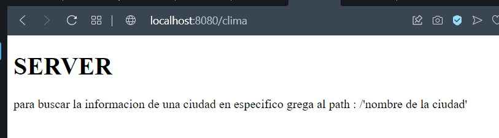
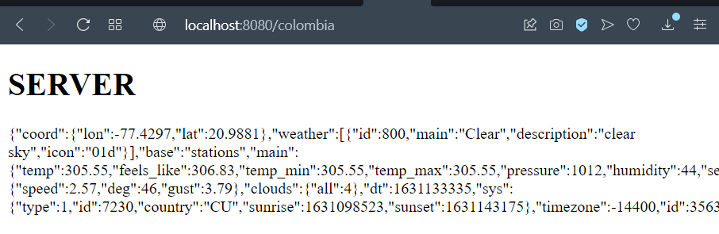

# Parcial 1

Su compañía lo ha seleccionado para construir una aplicación web simple desplegada en Heroku para uno de los clientes más importantes.
La aplicación debe consultar el estado del clima en lugares específicos de la tierra.  La aplicación recibirá en un campo la descripción de una ciudad, por ejemplo “London” para Londres   y deberá mostrar la información del clima para esa ciudad. Para esto utilice el API gratuito de https://openweathermap.org/ (Puede crear una cuenta para obtener la llave para realizar consultas). La petición debe pasar por su servicio web desplegado en Heroku, es decir desde su servicio en Heroku se debe invocar el servicio web de clima. El usuario no sabrá qué servicio está usted invocando por detrás. Utilice el servicio "Current Weather Data" de openweathermap.org.

Debe usar sockets solamente no puede usar ni spark ni spring. Usted debe implementar al menos dos servicios web, uno que retorne la página (La página debe estár quemada en el código) y otro que retorne le Json con los datos del clima.

La página debe invocar el servicio web de la ciudad de manera asíncrona y modificar la información directamente.

El API de la página debe ser el siguiente:

###Funcionamiento: 
Pagina pincial

uso con un pais 

# Heroku

## Construido con

* [Java] (https://www.oracle.com/technetwork/java/javase/downloads/jdk8-downloads-2133151.html)
* [Maven] (https://maven.apache.org/)

## Autores

* Juan Sebastian Garcia Hincapie 

## Licencia

Este proyecto está licenciado bajo la Licencia MIT - vea el archivo [LICENSE.md] (LICENSE.md) para más detalles
